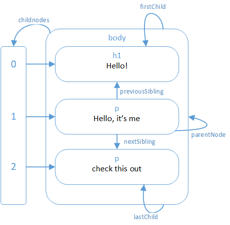

# Grokking Angular: Setting up shop: The Document Object Model (DOM) 
> Concepts on the Document Object Model (DOM) and how to interact with it from JavaScript

---
+ Presenting the DOM
+ Conceptualizing the DOM as boxes and as a tree
+ Navigating through the DOM
+ Finding Elements in the DOM
+ Changing the DOM
+ Creating Nodes
+ Element attributes
+ Some notions on document layout: block and inline elements
+ Styling elements with `<style>`
+ Intro to Cascading Style Sheets (CSS)
+ Query Selectors
+ Intro to Positioning and Animating
---


## Intro to DOM

Any HTML page can be conceptualized as a nested set of boxes. Some of them, can enclose some other boxes (*HTML tags*), which in turn can contain other boxes or text. 

```html
<!DOCTYPE html>
<html>
<head>
  <meta charset="utf-8" />
  <title>Hello!</title>
</head>
<body>
  <h1>Hello!</h1>
  <p>Hello, It's me</p>
  <p>check this out
    <a href="https://github.com/sergiofgonzalez/nodejs-in-action">here</a>.</p>
  </p>
</body>
</html>
```


Note that the `<p>` tag contains both text and another `<a>` tag.

The data structure the browser uses to represent the document follows this simple idea. For each box, there is an object, which we can interact with to find out things such as what HTML tag it represents and which boxes and text it contains.

This representation is known as the *Document Object Model* or *DOM* for short.

The global binding `document` gives us access to these objects. The property `document.documentElement` property refers to the object representing the `<html>` tag. Since every HTML document has a *head* and a *body*, it also has a `document.head` and a `document.body` properties that point at those elements.

## The DOM as a tree
The conceptual boxes from the previous diagram can only take us that far. However, the structure resembles the one of a tree data structure:
+ It has a branching structure, with no cycles
+ It has a well-defined root (`document.documentElement`).
+ Each node may refer to other nodes (children), which in turn may have their own children

In the *DOM tree*, the nodes are elements that represent the HTML tags. These can have child node, such as `document.body` and `document.head`. Some of these can be leaf nodes (nodes with no children), such as pieces of text or comment nodes.

This representation as a tree is much more powerful in programmatic sense:


Each DOM node object has a `nodeType` property which contains a code (number) that identifies the type of node. Elements have a code `1`, which is also defined as the constant `Node.ELEMENT_NODE`. Text nodes hav a code `3` (`Node.TEXT_NODE`) and comments have code `8` (`Node.COMMENT_NODE`).

All the element nodes in the DOM have a `childNodes` property, which holds an *array-like* object with a `length` property, but they are not arrays, and therefore does not have operations that real arrays have such as `map` and `slice`.

## Navigating through the DOM tree
The following diagram illustrates how to move through the DOM tree:



+ `parentNode` &mdash; points to the node it is part of, if any
+ `childNodes` &mdash; for *Node.ELEMENT_NODE* only, contains an array-like object holding its children
+ `firstChild` &mdash; points to the first child element, or *null*
+ `lastChild` &mdash; points to the last child element, or *null*
+ `previousSibling` &mdash; points to the previous adjacent node (node with the same parent appearing immediately before)
+ `nextSibling` &mdash; points to the next adjacent node (node with the same parent appearing immediately after)
+ `children` &mdash; like `childNodes` but only contains nodes of type `Node.ELEMENT_NODE` (that is, text nodes are skipped).

When dealing with tree data structures, recursive functions are really helpful. For example, the following snippet scans through an HTML document looking for text element containing the given string:

```javascript
function isStringFound(node, string) {
  if (node.nodeType === Node.ELEMENT_NODE) {
    for (let i = 0; i < node.childNodes.length; i++) {
      if (isStringFound(node.childNodes[i], string)) {
        return true;
      }
    }
    return false;
  } else if (node.nodeType == Node.TEXT_NODE) {
      return node.nodeValue.indexOf(string) > -1;
  }
}

console.log(isStringFound(document.body, 'loper'));
```

Note that:
+ You have to iterate the array with an index, because `node.childNodes` is not an array
+ You can access the content of a text node with the property `node.nodeValue`.

## Finding Elements in the DOM
There are methods available to find elements in the DOM without having to traverse the structure by ourselves.
For example, we can do:

```javascript
let link = document.body.getElementsByTagName('a')[0]
```

All element nodes have a `getElementsByTagName`, which collects all elements with the given tag name that are descendants of that node and returns them as an array-like object.

The method `document.getElementById` returns the specific single node whose `id` matches the given one:

```html
<p>My brand new car</p>
<p></p>

<script>
  let car = document.getElementById('car');
  console.log(car.src);
</script>
```

The method `getElementsByClassName` searches through the contents of an element node and retrieves all elements that have the given string in their class attribute.

## Changing the DOM
Everything in the DOM data structure can be changed. The shape of the document tree can be modified by changing parent-child relationships.

Nodes have a `remove` method to remove them from their current parent node. To add a child node to an element node, `appendChild` is available to place it at the end of the list of children, or `insertBefore(nodeToInsert, existingNode)` which inserts the node given as the first argument before the second one.

The following code sample rearranges the paragraphs:

```html
<body>
  <p>One</p>
  <p>Two</p>
  <p>Three</p>
  <script>
    'use strict';
    const paragraphs = document.body.getElementsByTagName('p');
    document.body.insertBefore(paragraphs[2], paragraphs[0]);
  </script>
</body>
```

A node can exist in the DOM in only one place. Thus, inserting a node somewhere will remove it from the current position.

The `replaceChild(newNode, existingNode)` method is used to replace a child node with another one.

## Creating Nodes
Text nodes are created with the `document.createTextNode` method.
As an example, the following code snippet replaces all `` elements with a text node whose content is the images `alt` attribute:

```html
  <p>The DOM's diagrams</p>
  
  
  
  <script>
    'use strict';
    function replaceImages() {
      const imageNodes = document.body.getElementsByTagName('img');
      for (let i = imageNodes.length - 1; i >= 0; i--) {
        const imageNode = imageNodes[i];
        if (imageNode.alt) {
          const textNode = document.createTextNode(imageNode.alt);
          imageNode.parentNode.replaceChild(textNode, imageNode);
        }
      }
    }
    replaceImages();
  </script>
```

Note that he loop that goes over the images starts at the end of the list. This is needed because the node list returned by methods such as `getElementsByTagName` is live &mdash; it is updated as the document changes. Thus, as we replace an image node with a text node, the array-like structure ends up having length = 2 after the second iteration, so that when `i=1`, we would be actually targetting the third image, rather than the second.

As an alternative, you can use `Array.from` or `[...array-like]` to obtain a solid array:
```javascript
function replaceImages() {
  const imageNodes = [...document.body.getElementsByTagName('img')];
  for (const imageNode of imageNodes) {
    if (imageNode.alt) {
      const textNode = document.createTextNode(`"${ imageNode.alt }"`);
      imageNode.parentNode.replaceChild(textNode, imageNode);
    }
  }
```

To create element nodes, use `document.createElement(tag)`.

The following example creates an utility function `elt` which creates an element node and treats the rest of its arguments as childrent to that node. The function is used to add an attribution to a quote:

```html
  <blockquote id="quote">
    The future is here. It's just not very evenly distributed.
  </blockquote>
  <script>
    'use strict';
    function elt(type, ...children) {
      const node = document.createElement(type);
      for (let child of children) {
        if (typeof child !== 'string') {
          node.appendChild(child);
        } else {
          node.appendChild(document.createTextNode(child));
        }
      }
      return node;
    }        

    document.getElementById('quote')
      .appendChild(
        elt('footer', '-', 
          elt('strong', 'William Gibson'), 
          ', interview on NPR ', 
          elt('em', 'Fresh Air'), 
          ', 1993'));
  </script>
```

## Attributes
Some element attributes, such as `href` for links, can be accessed through a property of the same name on the element's DOM object. This is the case for the most commonly used standard attributes.

As HTML allows you to set any attribute you want on nodes. The methods `getAttribute` and `setAttribute` are also available.

```html
<p data-classifier="secret">The launch code is 1234.</p>
<p data-classifier="unclassified">Hello to Jason Isaacs!</p>
<script>
  'use strict';
  const paragraphs = document.body.getElementsByTagName('p');
  for (const paragraph of [...paragraphs]) {
    if (paragraph.getAttribute('data-classifier') === 'secret') {
      paragraph.remove();
    }
  }
</script>
```

It is a general practice to prefix non-standard attributes with `data-` so that they do not clash with any other attributes.

| Note |
|------|
| The commonly used attribute `class` is a keyword in JavaScript. Therefore, from JavaScript you use the method `className`. Alternatively, you can do `getAttribute('class')`. |


## Layout
HTML defines two different types elements according to their layout:
+ **Block Elements** &mdash; Elements such as paragraphs `<p>` or `<h1>` headings, take up the whole width of the document and are always rendered on separate lines.
+ **Inline Elements** &mdash; Elements such as links `<a>` or `<strong>` are rendered on the same line with their surrounding text.

The size and position of an element can be accessed from JavaScript. The `offsetWidth` and `offsetHeight` properties give you the space the element takes up in pixels.

The methods `clientWidth` and `clientHeight` give you the space inside the element, ignoring border width.

The most effective way to find the precise position of an element on the screen is the `getBoundingClientRect`. It returns an object with `top`, `bottom`, `left` and `right` properties, indicating the pixel positions of the sides of the element relative to the top left of the screen.

If you want them relative to the whole document, the current scroll position should be added using `pageXOffset` and `pageYOffset`.

### About how the browser lays out elements
Browser do not automatically re-layout a document every time that JavaScript changes it because it is a lot of work. 
A program that repeatedly alternates between reading DOM layout information and changing the DOM forces a lot of layout computations that will make the browser run very slowly.

## Styling
The way tags are displayed in the browser is strongly tied to the element type. However, the style can be changed using the `style` property:

```html
<p><a href=".">Normal link</a></p>
<p><a href="." style="color: green">Green link</a></p>
```

A style attribute may contain one or more declarations, which are a property (such as `color`) followed by a colon and a value such as `green`. When there is more than one declaration, they must be separated by semicolons:

```html
<a href="." style="color: red; border: none">Red Link</a>
```

A lot of aspects of the document can be influenced with the styling. For example, you can force an inline element such as `<strong>` to be displayed as a block element, or even hidden.

```html
This text is displayed <strong>inline</strong>,
<strong style="display: block">as a block</strong>, and
<strong style="display: none">not at all</strong>.
```

JavaScript code can directly manipulate the style of an element through the element's `style` property. This property holds an object that has properties for all possible style properties.

```html
<p id="para" style="color: green">
  Nice green? text
</p>
<script>
  'use strict';
  const para = document.getElementById('para');
  console.log(para.style.color);
  para.style.color = 'purple';
</script>
```

Note that some style property have names such as `font-family` and have been capitalized in the methods `elem.style.fontFamily`.

## Cascading Styles
The styling system for HTML is called *CSS* for *Cascading Style Sheets*. A *style sheet* is a set of rules for how to style elements in a document.

This can be written inside a `<style>` tag:

```html
<style>
  strong {
    font-style: italic;
    color: gray;
  }
</style>
<body>
  <p>Now <strong>strong text</strong> is italic and gray.</p>
</body>
```

Cascading means that multiple rules can be combined to produce the final style for an element. In the example above the default *style* for `<strong>` elements is overlaid by the rule that adds a `font-style: italic` and a `color: gray`. The result will still have `font-weight: bold`.

When multiple rules define a value for the same property, the most recently read rule wins. Thus, if we would have written:

```html
<style>
  strong {
    font-weight: normal;
    font-style: italic;
    color: gray;
  }
</style>
```

then the text would have ended up being *not bold*.

Apart from targetting tags:
+ it is possible to target elements with a given value in their `class` attribute:

```html
<style>
  .subtle {
    color: gray;
    font-size: 80%
  }
</style>
<body>
  <p>This text is <span class="subtle">so subtle</span> that draws no attention.</p>
</body>
```

+ you can target elements with a given `id` using the following syntax:

```html
<style>
  #header {
    background: blue;
    color: white; /* element's text color */
  }
</style>  
<body>
  <p>This text is <span id="header">styled using the id</span>.</p>
</body>
```

+ you can combine selectors using the following syntax:

```html
<style>
  /* targets p tags with id="main" and class="a b" */
  p#main.a.b {
    border: 2px solid salmon;
  }
</style>
<body>
  <p id="main" class="a b">
      This is some text that would be affected by the previous rule.
  </p>
</body>  
```

It is important to note that the rule that makes the most recently rule wins only applies when the rules have the same *specificity*. A rule's specificity measures how precisely the rule describes the matching element. For example, the rule specified above is more specific that a rule that would target `p`, `p.a`, or `.a`.

+ target all `<a>` that are direct descendants of `<p>`.

```html
<style>
  p > a {
    border: 2px dashed red;
  }
</style>
<body>
  <p>
    This is an <a href=".">anchor</a> inside a paragraph.
  </p>
</body>
```

+ target all `<a>` that are direct or indirect descendants of `<p>`.

```html
<style>
  p a {
    border: 2px dashed black;
  }
</style>
<body>
  <p>
    This is an <a href=".">anchor</a> inside a paragraph.
  </p>
</body>
```

## Query Selectors
Query selectors is a very effective way to find elements in the DOM. The `querySelectorAll` (defined in both the `document` object and on element nodes), takes a selector string and returns a `NodeList` containing all the elements that it matches.

```html
  <p>
    And if you go chasing
    <span class="animal">rabbits</span>
  </p>
  <p>An you know you're going to fall</p>
  <p>
    Tell 'em a <span class="character">hookah smoking
    <span class="animal">caterpillar</span></span>
  </p>
  <p>Has given the call</p>
  <script>
    function count(selector) {
      return document.querySelectorAll(selector).length;
    }

    console.log(`number of paragraphs: ${ count('p') }`);
    console.log(`number of elements with class="animal": ${ count('.animal') }`);
    console.log(`number of elements with class="animal" inside a <p>: ${ count('p .animal') }`);
    console.log(`number of elements with class="animal" direct descendants of <p>: ${ count('p > .animal') }`);
  </script>
```

The advantage of using `querySelectorAll` is that the `NodeList` returned by it is not live &mdash; it won't change when you change the document. However, it is not a real array, so you will still need to use `Array.from` or `[...nodeList]` to use it as such.

The method `querySelector` works in a similar way, but it returns only the first matching element.

## Positioning and Animating
The `position` style property lets you influence the layout:
+ `static` &mdash;  by default, it has a value `static` which means that it will sit in its normal position. 
+ `relative` &mdash; the element will let you set the `top` and `left` style properties to move it relative to that normal place, and the element will still takes some space.
+ `absolute` &mdash; the element will be removed from the normal document flow, so that it no longer takes up space and can overlap with other elements. The properties `top` and `left` will let you position the element with respect to the top left corner of the nearest enclosing element whose `position` property isn't static, or relative to the document if no such enclosing element exists.

The following code sample displays a picture that moves around in an ellipse:

```html
  <p style="text-align: center">
    
  </p>
  <script>
    const img = document.querySelector('img');
    let angle = Math.PI / 2;
    function animate(time, lastTime) {
      if (lastTime != null) {
        angle += (time - lastTime) * 0.001;
      }
      img.style.top = `${ Math.sin(angle) * 20 }px`;
      img.style.left = `${ Math.cos(angle) * 200 }px`;
      requestAnimationFrame(newTime => animate(newTime, time));
    }
    requestAnimationFrame(animate);
  </script>
```

In the code, we set up the image centred in its position, and repeatedly update the picture's top and left according to that algorithm.

The script uses `requestAnimationFrame` to schedule the `animate` function, to run whenver the browser is ready to repaint the screen.
If we would just updated the DOM in a loop, the page would freeze and nothing would should up on the screen. Browsers do not update their display while a JavaScript program is running, and neither allows the user to interact with the page. That's the reason `requestAnimationFrame` is provided. The function requires an argument that is a function that is passed the current time, and uses it to calculate the angle to produce a smooth animation.


---
## You know you've mastered this section when...

+ You are aware that an HTML document can be concepualized as boxes that contain other boxes or as a tree structure. You know that the conceptualization is known as the *Document Object Model* (*DOM* for short).
+ You are comfortable using the properties and methods available to navigate through the elements of the *DOM* and recognize that recursive functions are very helpful for that type of tree structures: `childNodes`, `nodeValue`, `previousSibling`...
+ You are comfortable using the methods that allow you to find elements in the *DOM* by element tag, id or class name (`getElementsByTagName`, `getElementById`, `getElementsByClassName`).
+ You're comfortable using `remove` to remove elements from their current parent node, and `appendChild` to add a child to an element node. You're aware that `insertBefore` lets you position elements in a specific position among a node's children.
+ You can create elements with `document.createElement` and `document.createTextNode` to create text nodes.
+ You're aware that the list that is returned by methods such as `getElementsByTagName` is live, and therefore, it is updated while the document is being changed.
+ You're aware that you can use `getAttribute` and `setAttribute` to get and set standard and non-standard. You're aware that standard attributes are also defined as properties of the node.
+ You're aware of the different methods to obtain the positioning of an element in the document and in the screen: `clientWidth`, `clientHeight`, `getBoundingClientRect`.
+ You understand of the different values available for CSS `display`: `relative`, `absolute` and `none`.
+ You understand the general rules of precedence for CSS rules: the more specific rule always wins, between equal specifity, latest read rule wins.
+ You understand the basic syntax for specifying CSS rules for elements, ids, classes and its combinations. You understand how to affect elements that are descendents of given tags, and direct descendants of given tags.
+ You're comfortable using the `querySelectorAll` and `querySelector` and understand that those methods are preferred because they do not return a live array-like structure.
+ You're aware of the basics of animation, using `requestAnimationFrame`.
---

## Code Samples

### [01 &mdash; Hello, DOM scanning](./01-hello-dom-scanning)
An example that scans through an HTML document using DOM methods scanning for elements with a given text.

### [02 &mdash; Hello, DOM modifications](./02-hello-dom-modifications)
An example that modifies the structure of a given document.

### [03 &mdash; Hello, DOM creations](./03-hello-dom-node-creation)
Illustrates how to replace the `` tags of a document with a text node whose content is the image `alt` attribute.

### [04 &mdash; Element creation support function](./04-element-creation-support-function)
The example defines a support function `elt` that can be used to create elements. It is used to add an attribution to a quote.

### [05 &mdash; Accesing non-standard attributes](./05-accessing-non-standard-attributes)
Demostrates how to access non standard HTML attributes using `getAttribute` and `setAttribute`.

### [06 &mdash; Hello, element dimensions and positions](./06-hello-element-dimensions-and-position)
Demostrates how to obtain an element's dimensions and position.

### [07 &mdash; Alternating frequent reading and changing the DOM](./07-freq-read-change-dom)
Illustrates how doing frequent reading and changing the DOM has an impact in performance.

### [08 &mdash; Hello, styling](./08-hello-styling)
Illustrates how to change the default styling of an element using the `style` property, and how to interact with it from JavaScript.

### [09 &mdash; Hello, CSS](./09-hello-css)
Illustrates the usage of the `<style>` tag to create style sheets.

### [10 &mdash; Hello, Query Selectors](./10-hello-query-selectors)
Illustrates how to use `querySelectorAll` to find elements in the DOM.

### [11 &mdash; Hello, Positioning](./11-hello-positioning)
Illustrates how to animate an image on the screen using `position: relative`.

### [e01 &mdash; Programmatically building a table](./e01-programmatically-building-a-table)
The example illustrates how to build an HTML table programmatically from an array with data. 

### [e02 &mdash; findByTagName custom implementation](./e02-find-by-tag-name)
Demonstrates how to create a custom version of `document.getElementsByTagName` by traversing the document and accumulating the hits on an array.